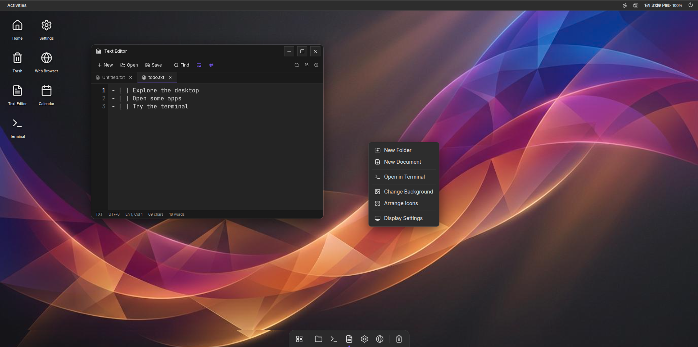

# Linux System

A web-based Linux desktop environment replica, styled after Ubuntu, featuring over 50 applications, all built using TypeScript and Vite.



**[View Live Demo](https://alekstar79.github.io/linux-system)**

<!-- TOC -->
* [Linux System](#linux-system)
  * [Features](#features)
  * [Technologies Used](#technologies-used)
  * [Getting Started](#getting-started)
    * [Prerequisites](#prerequisites)
    * [Installation](#installation)
    * [Running the Application](#running-the-application)
  * [Available Scripts](#available-scripts)
  * [Project Structure](#project-structure)
  * [Author](#author)
  * [License](#license)
<!-- TOC -->

## Features

- A fully functional desktop environment in your browser.
- Over 50 pre-installed applications.
- Window management with support for minimize, maximize, and close.
- App launcher and dock for quick access to your favorite apps.
- Customizable themes and wallpapers.
- Notification system.
- File manager for browsing the virtual file system.

## Technologies Used

- **Framework:** React
- **Build Tool:** Vite
- **Language:** TypeScript
- **Styling:** Tailwind CSS
- **UI Components:** @radix-ui/react
- **Icons:** lucide-react
- **Form Management:** react-hook-form
- **Schema Validation:** zod
- **Routing:** react-router
- **Linting:** ESLint

## Getting Started

### Prerequisites

- Node.js (v18 or higher)
- npm

### Installation

1.  Clone the repository:

    ```bash
    git clone https://github.com/alekstar79/linux-system.git
    ```

2.  Navigate to the project directory:

    ```bash
    cd linux-system
    ```

3.  Install the dependencies:

    ```bash
    npm install
    ```

### Running the Application

To start the development server, run:

```bash
npm run dev
```

The application will be available at `http://localhost:5173`.

## Available Scripts

- `npm run dev`: Starts the development server.
- `npm run build`: Builds the application for production.
- `npm run lint`: Lints the source code.
- `npm run preview`: Serves the production build locally.

## Project Structure

```
/
├── public/              # Static assets
├── src/                 # Source code
│   ├── apps/            # Application definitions
│   ├── components/      # React components
│   ├── hooks/           # Custom React hooks
│   ├── lib/             # Utility functions
│   ├── types/           # TypeScript types
│   ├── App.tsx          # Main application component
│   └── main.tsx         # Entry point
├── .eslintrc.cjs        # ESLint configuration
├── package.json         # Project metadata and dependencies
├── tsconfig.json        # TypeScript configuration
└── vite.config.ts       # Vite configuration
```

## Author

- **Aleksey Tarasenko**
- **Email:** <alekstar79@yandex.ru>
- **GitHub:** [alekstar79](https://github.com/alekstar79)

## License

This project is licensed under the MIT License. See the [LICENSE](LICENSE) file for details.
